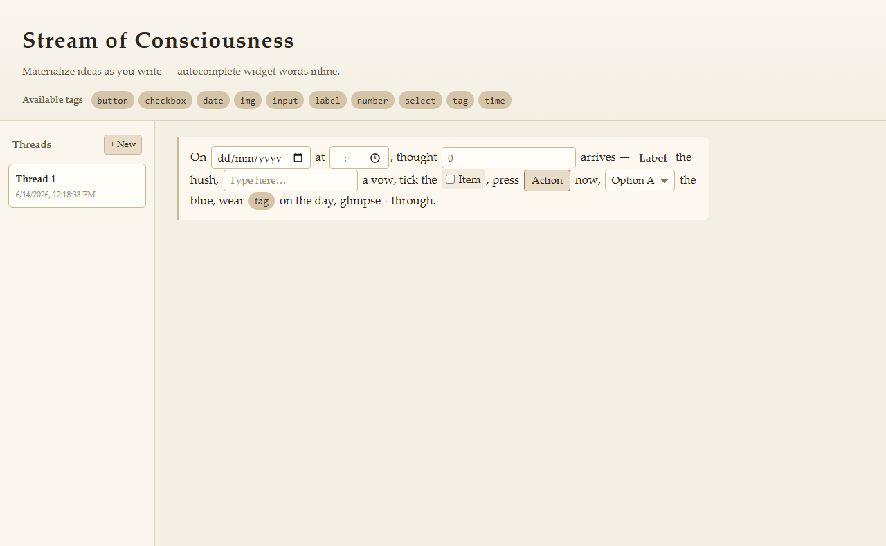

# Stream of Consciousness

**v1.0.1**

A diary-style writing surface where ideas flow as plain text and **autocompletable keywords** materialize into inline UI widgets — buttons, inputs, images, and more — without leaving the sentence.

## Demo

All widget tags woven into a single thread — generated by the E2E poem test:



> On **date** at **time**, thought **number** arrives — **label** the hush, **input** a vow, tick the **checkbox**, press **button** now, **select** the blue, wear **tag** on the day, glimpse **img** through.

## Features

- **Hybrid stream** — one continuous canvas per thread; each paragraph is a visually distinct block
- **Widget autocomplete** — type a keyword (e.g. `but`, `date`, `img`) and pick from the menu to insert an inline component
- **Right-click editing** — edit widget properties; buttons support modal, confirm, and URL click actions
- **Copy & paste** — duplicate widgets via context menu or Ctrl+C / Ctrl+V (Clipboard API)
- **Multiple threads** — sidebar to create, rename, switch, and delete threads
- **Auto-save** — editor state persists to `localStorage` (~400ms debounce)

## Available widgets

| Keyword   | Widget   |
|-----------|----------|
| `button`  | Button (with optional modal / confirm / URL on click) |
| `checkbox`| Checkbox |
| `date`    | Date picker |
| `time`    | Time picker |
| `number`  | Number input |
| `input`   | Text input |
| `select`  | Dropdown |
| `label`   | Label text |
| `img`     | Image (random Unsplash default) |
| `tag`     | Tag pill |

Keywords appear in the header bar and match after 2+ characters.

## Getting started

Requires [Node.js](https://nodejs.org/) and [Yarn](https://yarnpkg.com/) 4.

```bash
yarn install
yarn dev
```

Open [http://localhost:5173](http://localhost:5173).

### Scripts

| Command        | Description              |
|----------------|--------------------------|
| `yarn dev`     | Start dev server         |
| `yarn build`   | Typecheck and build      |
| `yarn preview` | Preview production build |
| `yarn test`    | Run unit tests           |
| `yarn test:e2e`| Run Playwright E2E tests (screenshots in `e2e/screenshots/`) |
| `yarn test:e2e:ui` | Run E2E tests in Playwright UI |
| `yarn test:all`| Run unit + E2E tests     |

First-time E2E setup also requires browser binaries:

```bash
yarn playwright install chromium
```

## Tech stack

- React 19 + TypeScript
- [Lexical](https://lexical.dev/) — rich text editor with custom decorator nodes
- Vite — bundler and dev server
- Vitest + happy-dom — unit tests
- Playwright — E2E tests and screenshots

## Project layout

```
src/
├── App.tsx                 # Shell, threads sidebar, modal provider
├── components/             # ThreadSidebar, AvailableTags
├── editor/
│   ├── nodes/              # Widget Lexical nodes (button, date, img, …)
│   ├── plugins/            # Autocomplete, clipboard, persistence
│   └── widgets/            # Registry, edit UI, clipboard helpers
├── hooks/useThreads.ts     # Thread state + localStorage
├── modal/                  # App-wide alert / confirm modals
└── storage/threads.ts      # Thread persistence helpers
e2e/
├── app.spec.ts             # Playwright E2E tests
└── screenshots/            # Generated full-page screenshots (gitignored)
docs/
└── 07-poem-all-tags.png    # README demo screenshot
```

## Usage tips

1. Click the editor and start writing.
2. Type a widget keyword and select it from the autocomplete menu.
3. **Right-click** any widget → **Edit widget**, **Copy widget**, or **Paste widget**.
4. For buttons with **Confirm modal**: confirming shows a ✓ on the button.
5. Use **+ New** in the sidebar for another thread; double-click a thread name to rename.

Data is stored in the browser under the key `stream-of-consciousness-threads`.

## License

MIT — see [LICENSE](LICENSE).
